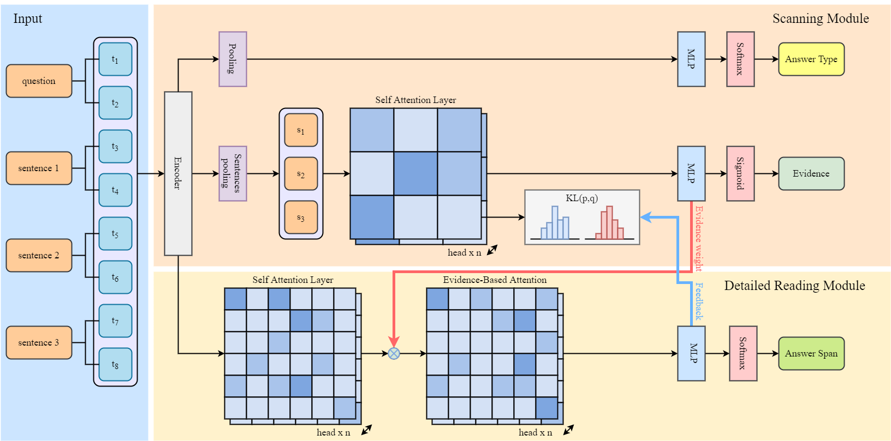

# Evidence-Based Feedback Reader for judicial reading comprehension



## Requirements

```bash
pytorch==1.7.1
transformers==4.6.0
```

## Resources


CJRC dataset can be downloaded [here](https://github.com/china-ai-law-challenge/CAIL2019/tree/master/%E9%98%85%E8%AF%BB%E7%90%86%E8%A7%A3/data)  and put it in cail2019/

cail2020 dataset can be downloaded [here](https://github.com/china-ai-law-challenge/CAIL2020/tree/master/ydlj/data) and put it in cail2020/

pretrained Roberta  can be download [here](https://huggingface.co/hfl/chinese-roberta-wwm-ext/tree/main)

## Checkpoints
You can download checkpoints for [cail2020](https://drive.google.com/file/d/1671rR5KApuneXunaPLU2EOhHO7EMg-3_/view?usp=share_link) and [CJRC](https://drive.google.com/file/d/1b9cxjzZQyvJ9g0iZPxV-D-dhuFrw0XZ4/view?usp=share_link) (cail2019) here, unzip them and put the pkl files under output/checkpoints/train_v1/

### Test CJRC

```bash
python data_2019_preprocessing.py
bash preprocess_2019.sh
bash test_cail2019.sh
```

### Test cail2020

```
python data_2020_split.py 
bash preprocess_2020.sh
bash test_cail2020.sh
```

## Train

run CJRC

```bash
python data_2019_preprocessing.py
bash preprocess_2019.sh
bash run_cail2019.sh
```

run cail2020

```
python data_2020_split.py 
bash preprocess_2020.sh
bash run_cail2020.sh
```

## Result on test sets 
Platorm: Linux+torch 1.7.1+cu11 + RTX3090

|          | ans EM | ans F1 | sup EM | Sup f1 | joiint em | joint f1 |
| -------- | ------ | ------ | ------ | ------ | --------- | -------- |
| CJRC| 0.5721| 0.7953| 0.8414| 0.8886| 0.5608| 0.7634|
| CAIL2020 | 0.6855| 0.7629| 0.4561| 0.7718| 0.3770| 0.6404|

## Acknowledgment

Our code makes a heavy use of Huggingface's [PyTorch implementation](https://github.com/huggingface/transformers),  [CAIL2020 baseline](https://github.com/china-ai-law-challenge/CAIL2020/tree/master/ydlj/baseline) and [transformer  Pytorch Implementation](https://github.com/jadore801120/attention-is-all-you-need-pytorch). We thank them for open-sourcing their projects.

